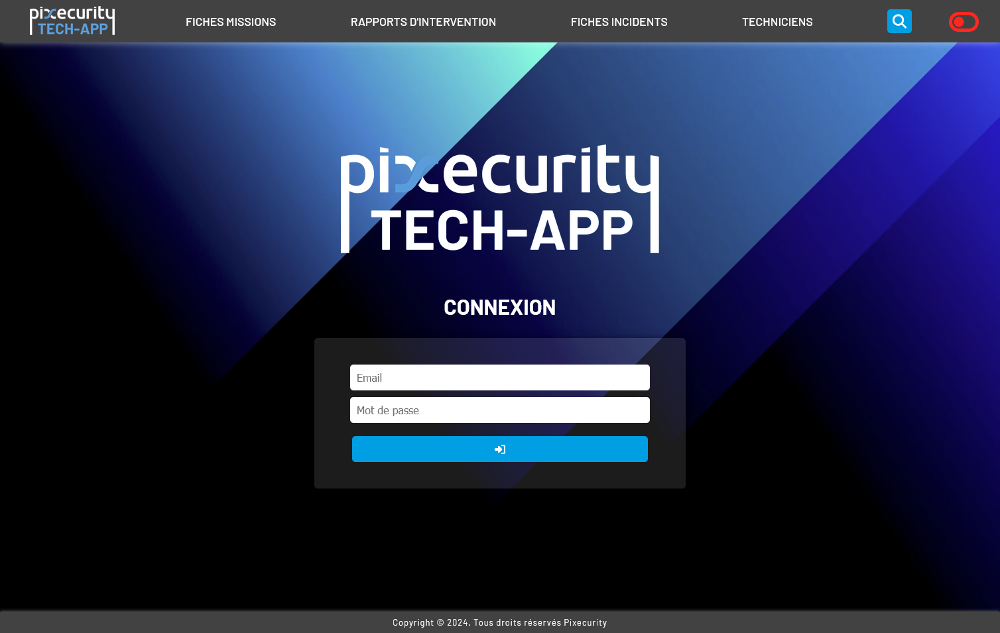
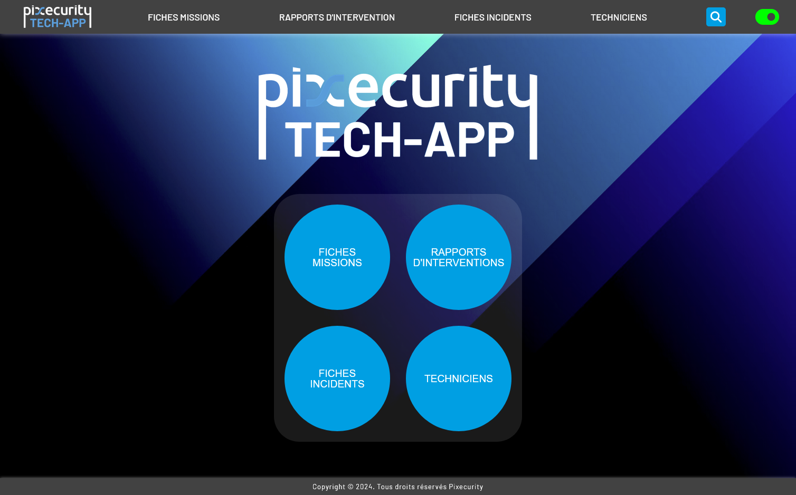
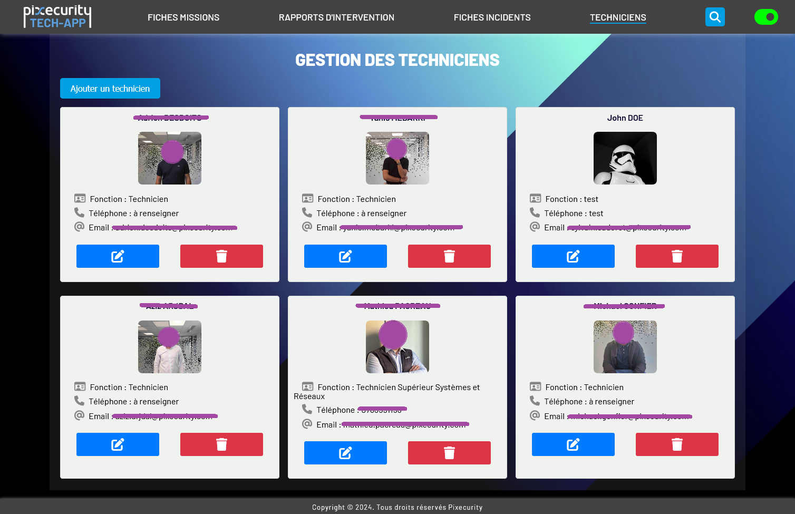
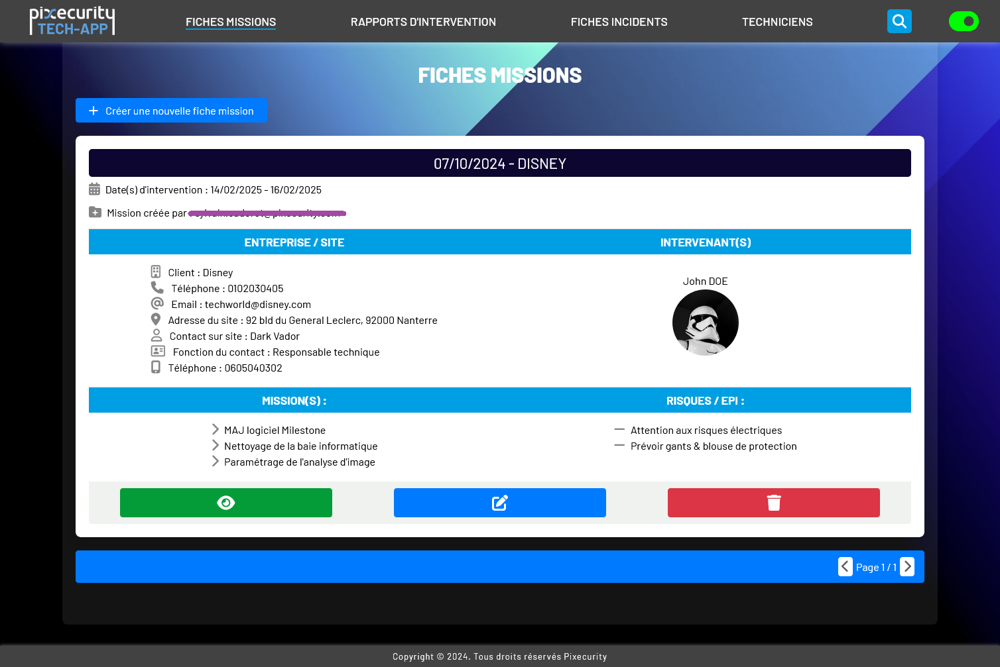
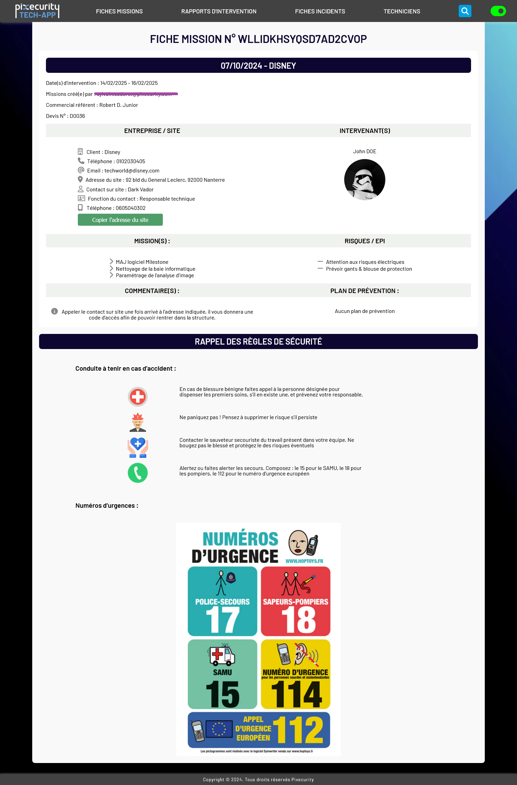
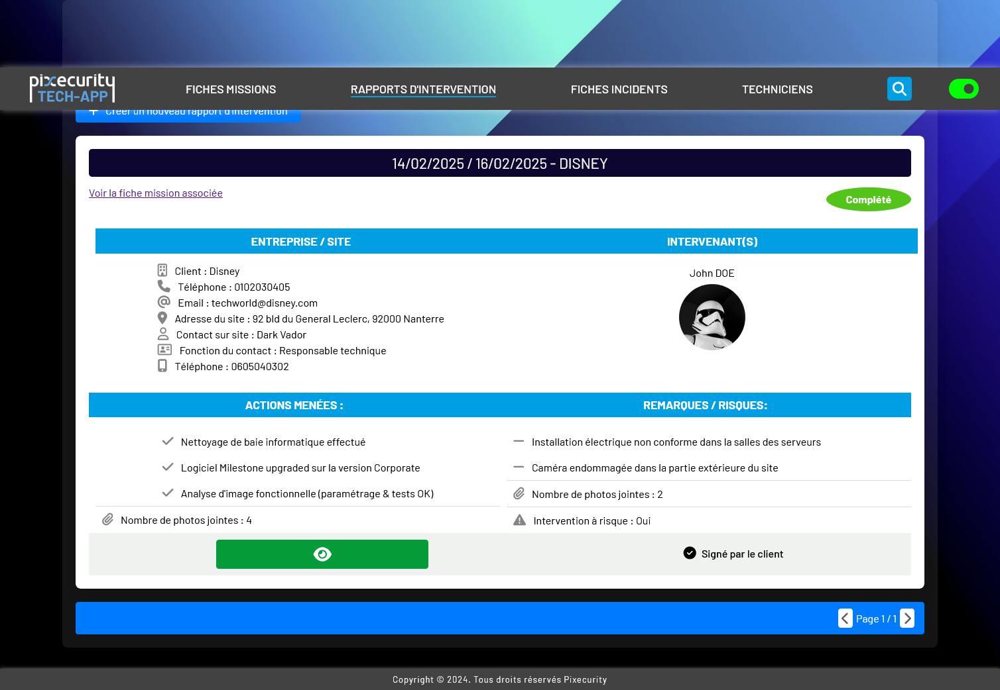
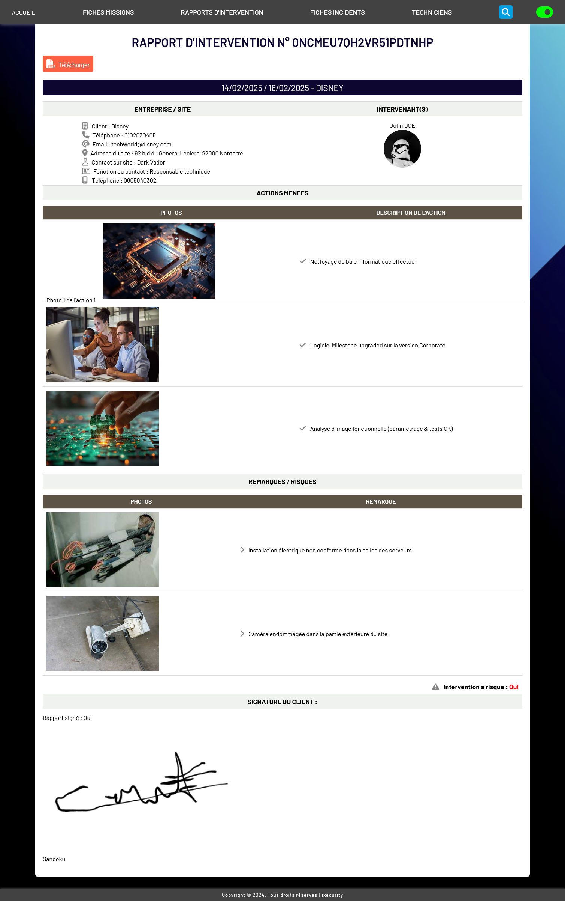

# Pixecurity - Application de Rapports d'Intervention

Cette application web est développée pour faciliter le travail des techniciens de Pixecurity sur le terrain. Elle leur permet de remplir des rapports d'intervention, d'ajouter des photos, de faire signer les clients, et de générer des rapports PDF envoyés par e-mail.

## Table des matières
- [Fonctionnalités](#fonctionnalités)
- [Technologies utilisées](#technologies-utilisées)
- [Screenshots](#screenshots)

## Fonctionnalités

L'application permet à l'entreprise de :
- Gérer les profils techniciens.
- Créer et gérer des fiches missions pour les chantiers/interventions.
- Ajouter des actions menées, remarques et photos au rapport d'intervention.
- Faire signer les rapports d'intervention.
- Générer automatiquement des fiches d'incidents si des risques sont identifiés.
- Voir et rechercher les rapports d'intervention existants.
- Intégrer les commentaires & photos directement dans les rapports PDF générés.

## Technologies utilisées

L'application utilise les technologies suivantes :
- **Frontend** : React, SCSS
- **Base de données et stockage** : Firebase Firestore, Firebase Storage
- **Authentification** : Google OAuth (pour les utilisateurs Outlook)
- **Déploiement** : Google Hosting 
- **Envoi d'emails** : EmailJS
- **Signature électronique** : react-signature-canvas
- **Compression/optimisation des photos** : react-image-file-resizer
- **Génération de document PDF** : jspdf
- **Animations** : framer-motion & sweetalert2

## Screenshots

 

